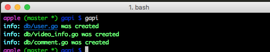

# gapi

Generate API for your golang project automaticly

### how to use

1. install

```
go install go install github.com/scott-x/gapi
```

2. create a sql file which is named `temp.sql` in your under your project

3. run command `gapi`



